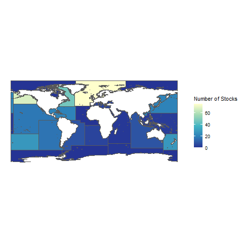

## Background and Objective
The relationship between recruitment and spawning biomass has been of interest to fishery scientists and managers for decades. However, the primary driver in the spawner-recruit relationship has been a source of debate. Myers and Barrowman (1996) suggested reduced spawning biomass was associated with reduced recruitment. Gilbert (1997) argued that instead of spawning biomass driving recruitment, changes in recruitment resulted in lower spawning biomasses. Szuwalski et al. (2015) examined the common assumptions about recruitment drivers using the RAM Legacy Stock Assessment database. Out of the 224 stocks examined, only 88 had a significant positive correlation between spawning biomass and recruitment. In 52 of those 88 stocks, recruitment had a stronger influence on spawning biomass than spawning biomass on recruitment.  61% of the total stocks had no significant relationship between spawning biomass and recruitment. Our goal was to determine if these results still hold with the addition of new time series data to the RAM database. Also, we were interested if the presence and duration of recruitment regimes was correlated with fish lifespan.  
  
  
```{r, echo=FALSE, out.width = 300px, fig.cap="Map of the number of stocks included in the analysis by FAO major fishing region"}



```

## Methods
Recruitment and spawning biomass time series data were collected from the RAM Legacy Stock Assessment database (doi:10.5281/zenodo.4824192). The RAM database compiles stock assessment results from the world’s fisheries. For this analysis, only stocks with at least 20 years of contiguous time series data were included. Stocks that derived their recruitment time series directly from the stock-recruitment relationship were eliminated. The remaining 316 stocks represented 163 species in 15 different FAO regions (see Figure 1).  

To determine the nature of the relationship between spawning biomass and recruitment, Spearman’s correlation for the time series was calculated. Stocks with a significant positive correlation between spawning biomass and recruitment were categorized as influenced by spawning biomass. Stocks without a significant correlation between spawning biomass and recruitment were considered environmentally driven. Spearman’s correlation is preferable to Pearson’s correlation in this scenario, as it removes the assumption of linearity (Spearman 1904). Stock-recruitment curves are often monotonically increasing, but not linear. Due to compensatory dynamics at high spawning biomasses, some stocks had a dome-shaped curve. Those stock-recruitment curves were not monotonically increasing. Spawning biomass-recruitment pairs that were greater than 50% of the maximum observed spawning biomass were removed. Without those points, the curves were monotonically increasing.  

The procedure outlined by Szuwalski et al. (2015) was used to determine the stock-recruitment curve shape. Figure 2 depicts a flow-chart of the procedure. First, both a Ricker and Beverton-Holt stock-recruitment curve were fit to each stock. Then the relative likelihood of each model was calculated using the formulas below:
$$
Relative Likelihood (Mod_{min}) = \frac{1}{1 + exp(\frac{AICc(Mod_{min}) - AICc(Mod_{max})}{2})}
$$

$$
Relative Likelihood (Mod_{max}) = \frac{exp(\frac{AICc(Mod_{min}) - AICc(Mod_{max})}{2})}{1 + exp(\frac{AICc(Mod_{min}) - AICc(Mod_{max})}{2})}
$$

$Mod_{min}$ refers to the model (Ricker or Beverton-Holt) with the minimum AICc value. $Mod_{max}$ refers to the model with the larger AICc value. A relative likelihood for the Ricker model ≥ 0.75 indicated a dome-shaped stock-recruitment curve following Szuwalski et al. (2015). Stocks below the cut-off were considered monotonically increasing. Before calculating Spearman’s correlation for the dome-shaped stocks, stock-recruitment pairs greater than 50% of the maximum spawning biomass were removed. The resulting data were monotonically increasing and no longer violated the assumption needed for Spearman’s correlation. If Spearman’s correlation was significant and positive, the stock was designated as driven by spawning biomass.  

Stocks with a relative likelihood < 0.75 were considered monotonically increasing. The data points for each series were ranked and the cross correlation for the spawning biomass and recruitment at different lags were calculated. The zero-lagged correlation is indicative of the effect of spawning biomass on recruitment, as recruitment in the RAM database is already lagged to the year of fertilization. Correlations at negative lags are indicative of the influence of recruitment on spawning biomass. For these stocks, to be driven by spawning biomass, 1) the zero-lagged correlation coefficient must be statistically significant and 2) the correlation coefficients for the negative lags need to be less than the zero-lagged coefficient. Stocks without a statistically significant zero lag were considered environmentally driven. Edge cases, where the recruitment driver could not be determined definitively, had both a significant zero lag coefficient and negative lag coefficients greater than the zero-lag coefficient. Choosing the largest correlation value *post hoc* can increase the chance of spurious results. However, Szuwalski et al. (2015) found that 95% of the significant negative lags in the stocks they analyzed to be within two years of the age-at-50%-maturity for the stock. As such, significant negative lags were considered a sufficient indicator of recruitment on spawning biomass. Figure 3 shows stocks with different patterns in cross correlation and stock-recruitment curve shape.  

The stocks with evidence of environmentally driven recruitment were examined for regime changes in recruitment. Regimes, or changes in the average recruitment or variance, were determined using the pruned exact linear time (PELT) algorithm in the R *changepoint* package. PELT is based on the Optimal Partitioning approach (Jackson et al. 2005), but includes a pruning step. First, the optimal change point in the data is calculated via minimizing a cost function, usually two times the negative log likelihood. Subsequent change points are detected by conditioning the cost function on the data from the previous change point to the end of the series. By working backwards, the PELT algorithm “prunes” potential points from the dataset that are after the previous change point, reducing the computational time (Killick, Fearnhead, and Eckley 2012). PELT has been shown to be faster and more accurate than other multiple changepoint detection algorithms, such as binary segmentation (Killick, Fearnhead, and Eckley 2012). The minimum regime duration was set at 6 years, to capture sub-decadal variation. The PELT algorithm can detect changepoints using a variety of statistical criteria. For our analysis, we used Akaike information criterion (AIC) as our penalty to avoid over-fitting the data. Without a penalty function, the algorithm would consider any stochasticity in the data as a regime change.  

Finally, we explored if any relationships existed between fish lifespan, the shape of the stock-recruitment curve, and the presence and length of recruitment regime changes. The reported maximum age for each species was retrieved from FishBase, governmental agencies, or otolith aging studies. The source for each species’ age data can be found on the GitHub repository for this analysis. An estimate for lifespan was found for 149 out of 163 species. Of the 14 species without age data, 8 were invertebrates. Invertebrates are often challenging to age, due to the molting process. Figure 4 shows the distribution of max age reported for the stocks included in the analysis.  

## Results
Out of the 316 stocks analyzed, 30% showed evidence of spawning biomass primarily influencing recruitment and 61% showed evidence of environment influencing recruitment. For 28 stocks, we were unable to identify a primary driver. The recruitment for those stocks could be driven by either the environment or spawning biomass or both. Bigeye tuna from the West Pacific stock, Atlantic cod from the Canadian East Coast stock, and the Alaskan stock of yellowfin sole all had a significant negative correlation between spawning biomass and recruitment. However, since the criteria for spawning biomass as a driver was a significant positive correlation between spawning biomass and recruitment, these stocks were considered to also be influenced by the environment. The average maximum reported age for each category of stocks was similar. The highest average age was the 28 stocks without a primary recruitment driver. A summary of the mean maximum reported ages can be found in Table 1.  

92% of the environmentally influenced stocks had at least one change in average recruitment or variance. The mean regime length was 11 years with a standard deviation of 6.41 years. 193 out of the 206 stocks with a regime change also had age data, with 81% of stocks living less than 40 years. The average regime length was similar across all age categories. Standard deviation in regime length was smallest among stocks with a maximum age between 1 and 10 years. The standard deviation for the older age categories was similar. A summary of the mean regime lengths and standard deviations for different maximum age categories is found in Table 2.  

In the 6 years since Szuwalski et al.’s analysis, the number of stocks that fit our criteria has increased, from 224 to 316. The proportion of stocks with dome-shaped and monotonic dynamics stayed consistent (17% dome-shaped in both analyses). The relative proportions of stocks influenced by spawning biomass or the environment are similar. However, this analysis found more stocks with a significant positive relationship of spawning biomass on recruitment (30% versus 16% of total). Also, fewer stocks had evidence of recruitment influencing spawning biomass more than spawning biomass influencing recruitment (28 versus 52). The longer time series may have allowed the dynamics to be teased apart further. For example, the recruitment driver for the Alaskan Pacific herring stock was initially classified as “environment and/or spawning biomass”. With the inclusion of new data, the Alaskan Pacific herring stock recruitment is now classified as driven by spawning biomass. Conversely, the Alaskan arrowtooth flounder stock has changed classifications to be environmentally driven. Figure 5 includes graphs depicting the stock-recruitment curve and cross-correlation plot for each of these stocks. Table 3 lists stocks that were re-classified to new categories and stocks both studies were unable to find a primary driver for. The lifespan of the stock species does not appear to influence the primary driver of recruitment or the presence of regime changes in recruitment. The complete analysis, as well as figures for each of the stocks, can be found in our GitHub repository.  

## References